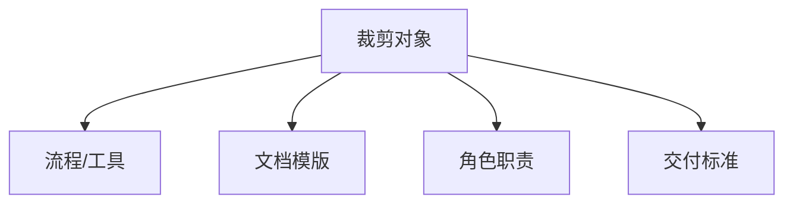

## 1.1.3 裁剪

#### 裁剪
在项目管理中，“裁剪（Tailoring）”指根据项目的具体需求、环境、团队特点等因素，对标准项目管理方法论、流程或框架进行有选择的调整、删减或补充，使其更贴合实际项目情境。裁剪的核心是 “适应性优化”
>进行裁剪时需要了解项目背景，目的和运行环境，需要平衡潜在的互相矛盾的要求

|场景|问题|裁剪目的|
|:-|:-|:-|
|方法论不匹配|用瀑布模型管理需求模糊的项目|降低流程复杂度，增加灵活性|
|资源限制|团队只有5人，无法按标准Scrum分配3种角色|合并角色职责|

#### 裁剪的四个核心维度

__1. 流程/工具裁剪__
- 删减：跳过非必要会议（如小型项目取消每日站会）
- 替换：用在线看板（Trello）替代复杂的项目管理软件（Jira）
- 新增：在敏捷中加入风险评审会（原框架无此要求）

__2. 文档模板裁剪__ 
- 50页需求规格说明书	→ 精简为用户故事地图（User Story Map）
- 周报模板含10个字段	→ 保留“进展/风险/下周计划”3项

__3. 角色职责裁剪__
- 传统项目中：开发工程师兼职测试（省去专职测试岗）
- Scrum团队中：PO同时承担UX设计职责

__4.交付标准裁剪__
- 将“完成定义”（DoD）从 “100%测试覆盖” 调整为 “核心路径测试通过”
- 允许MVP（最小可行产品）暂不包含非关键功能