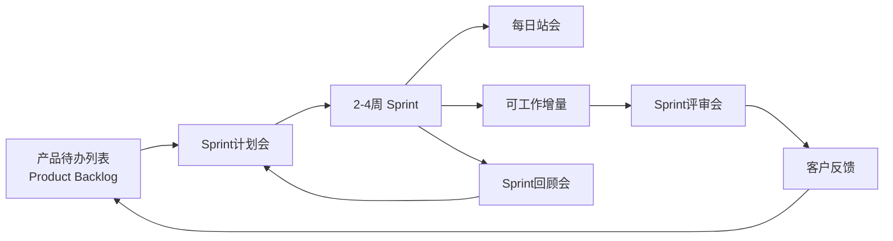

## 1.1.4 Scrum

#### 定义
> Scrum 是一种 迭代式增量开发框架，通过短周期（Sprint）交付可工作的产品增量，强调团队自组织、快速响应变化和持续改进。

#### 核心目的
- 用最小成本验证产品方向
- 通过频繁交付降低风险
- 最大化客户价值

#### 工作流程

#### 3种角色
1. 产品负责人（Product Owner, PO）
> 最大化产品价值，确保团队开发的功能符合客户/业务需求。
> - 对“做什么”拥有最终决策权
> - 唯一有权调整待办列表优先级的人

2. Scrum Master（SM）
> 保护团队高效运转，确保Scrum流程正确实施并持续改进。
> - 对“如何做流程”拥有话语权
> - 解决阻碍团队的问题（如：跨部门协作卡点、工具故障）

3. 开发团队（Development Team）
> 交付可工作的产品增量，每个Sprint结束时产出符合质量标准的成果。
> - 估算任务工作量
> - 改进技术实践（如引入自动化测试）
> - 估算任务工作量