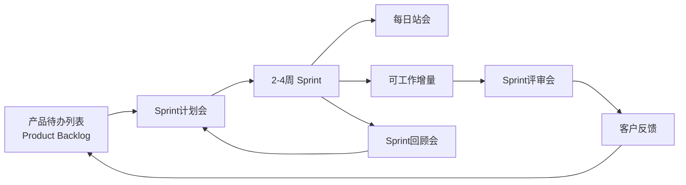

## 1.1.4 Scrum

#### 定义
> Scrum 是一种 迭代式增量开发框架，通过短周期（Sprint）交付可工作的产品增量，强调团队自组织、快速响应变化和持续改进。

#### 核心目的
- 用最小成本验证产品方向
- 通过频繁交付降低风险
- 最大化客户价值

#### 工作流程

#### 产品Backlog（Product Backlog）
> 产品Backlog是整个产品的需求总清单，包含所有已知的功能、非功能需求（如性能优化）、技术任务（如重构）以及缺陷修复等。

#### Sprint
> Sprint（冲刺） 是团队完成一定量工作的固定周期（时间箱），通常为 1-4周（最常见的是2周）。它是Scrum的核心迭代单元，所有Scrum事件（如计划会议、每日站会、评审会、回顾会）都围绕Sprint展开。
- __固定时长__（Time-boxed）每个Sprint有明确的开始和结束时间（如周一至第二周周五），长度一旦确定，一般不会中途改变
- __交付“潜在可发布”的产品增量__ 每个Sprint结束时，团队必须交付一个可用的、测试过的产品功能增量（哪怕很小）
- __不允许中途变更目标__ Sprint的目标（Sprint Goal）和范围在计划会议上确定后，产品负责人（PO）不能中途插入新需求（紧急情况需团队协商）。

#### Sprint的流程与关键事件
___1.___ Sprint计划会议（Sprint Planning）
- 产品负责人（PO）讲解高优先级的需求（来自产品Backlog）。
- 开发团队选择能完成的条目，并拆解为具体任务（形成Sprint Backlog）。
- 确定Sprint目标（如“实现用户注册流程”）。

___2.___ 每日站会（Daily Scrum）
- 昨天做了什么？
- 今天计划做什么？
- 遇到什么障碍？

___3.___ Sprint评审会（Sprint Review）
- 团队向PO和利益相关者演示完成的功能。
- 收集反馈，可能调整产品Backlog。

___4.___ Sprint回顾会（Sprint Retrospective）
- 团队反思改进点（如流程、协作、工具），制定下一个Sprint的优化计划。

#### 3种角色
1. 产品负责人（Product Owner, PO）
> 最大化产品价值，确保团队开发的功能符合客户/业务需求。
> - 对“做什么”拥有最终决策权
> - 唯一有权调整待办列表优先级的人

2. Scrum Master（SM）
> 保护团队高效运转，确保Scrum流程正确实施并持续改进。
> - 对“如何做流程”拥有话语权
> - 解决阻碍团队的问题（如：跨部门协作卡点、工具故障）

3. 开发团队（Development Team）
> 交付可工作的产品增量，每个Sprint结束时产出符合质量标准的成果。
> - 估算任务工作量
> - 改进技术实践（如引入自动化测试）
> - 估算任务工作量