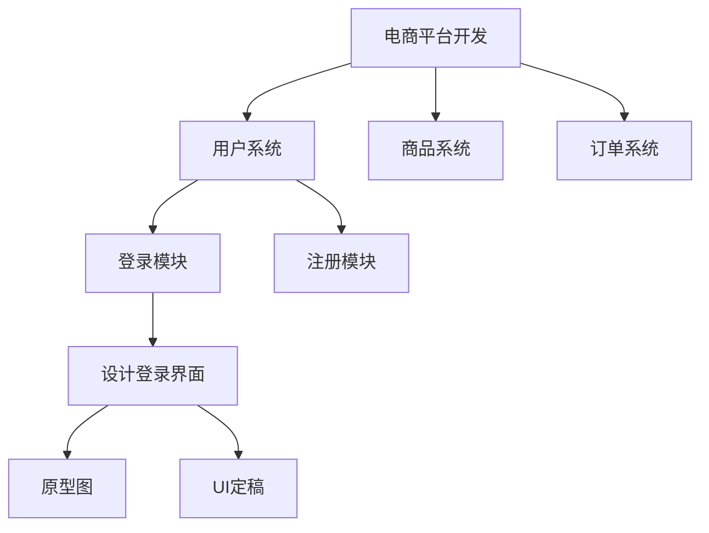

## 1.1.5 WBS 工作分解结构

#### WBS 的本质
WBS（Work Breakdown Structure，工作分解结构） 是项目管理的核心工具，用于将复杂项目逐层分解为可管理的小型任务单元

#### WBS树形图

#### 创建 WBS 的四步法
1. 识别主要交付物
> 例：APP项目 = 前端 + 后端 + 数据库 + 测试报告）
2. 逐层分解到工作包
>（工作包标准：1人负责，耗时≤80小时，有明确输出）
3. 分配唯一编码
>（如 1.3.2.4 = 项目1→系统3→模块2→工作包4）
4. 验证完整性
> - 是否覆盖所有需求？
> - 工作包是否可执行？

#### WBS 的三大核心价值
1. 防遗漏：确保所有工作可见（避免“黑洞任务”）
2. 控范围：明确项目边界（防止需求蔓延）
3. 促协作：为任务分配/进度跟踪提供基础框架