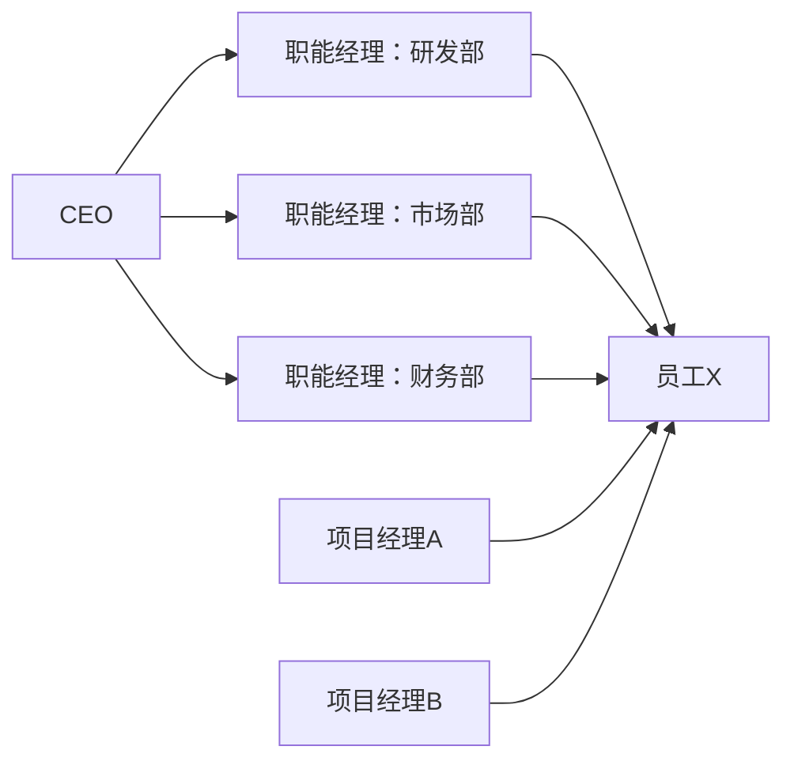
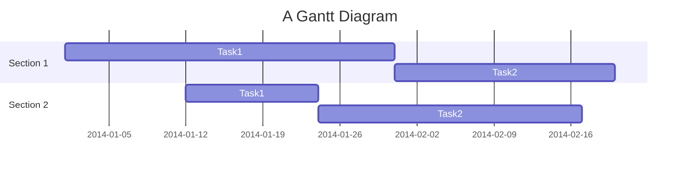
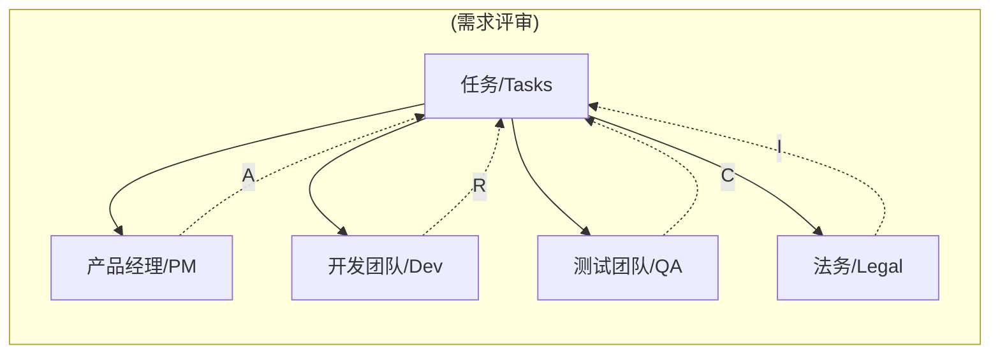

## Project Management

#### Key Responsibilities
1. Planning and organizing
2. Managing Tasks
3. Budgeting and controlling costs and other factors

#### Project Management Styles
1. [Waterfall](#Watefall)
   - linear approach
   - follow an ordered set of steps that are directly linked to clearly defined expectations
2. [Agile](#Agile)
   - able to move quickly and easily
   - willing to change and adapt
   - done in pieces
## Project Life Cycles
1. __Initiate the project__
    - define proejct goals
    - determine resources, people and other project details
    - get project approval
2. __Make a plan__
    - create a budget
    - set the schedule
    - establish your team
    - determine roles and responsibilities
    - establish communications
3. __Execute & complete tasks__
    - manage the progress
    - communicate
    - make adjustments
4. __close the project__
    - ensure all tasks have been completed
    - confirm acceptance of the project outcome
    - reflect on lessons learned
    - communicate results with stakeholders
    - celebrate completing the project
    - formally move on from the project

#### Organizational Structure

## Classic Structure
> Traditional top-down system of reporting
## Matrix Structure
> Direct higher-ups to report to and stakeholders from other departments or programs

## Scope creep
> Scope creep is when the scope changes after you've already started the project  

It's all about prioritizing which element __(scope - time - cost)__ matters the most in the project

## Work breakdown structure (WBS)
A tool that sorts the milestones and tasks of a project in a hierarchy, in the order they need to be completed
> one common way is to create a tree diagram of project tasks

## Gantt chart
> A horizontal bar chart that maps out a project schedule

## RACI Chart
A RACI matrix (Responsible, Accountable, Consulted, Informed) is a responsibility assignment tool that clarifies roles and tasks in projects or processes.

#### project/项目
> One single-focused endeavor
#### program/项目集
> A collection of projcts
#### portfolio/项目组合
> A collection of projcts and programs across the whole organization

## Retrospective
> A workshop or meeting that gives project teams time to reflect on a project after a project/milestone is completed

## Types of project management meetings
- Project kick-off
    > The official beginning of a project and serves as a way to align the team's understanding of the project goals with actual plans and procedures
- Status updates
    > This category includes regular team meetings where the primary goal is to align the team on updates, progress, challenges, and next steps
- Stakeholder reviews
    > The goal of a stakeholder meeting is to get buy-in and support
    > - present a project update
    > - seek and listen to feedback
    > - make a decision or resolve a major issue
- Project reviews
    > - Lessons learned - what worked/what to improve
    > - Celebration
    